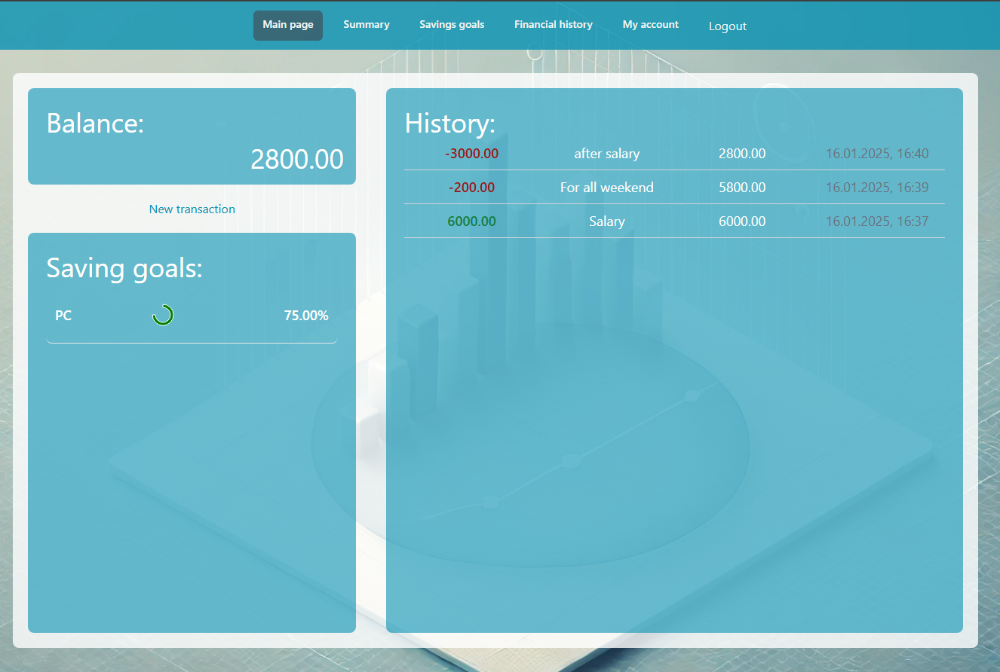
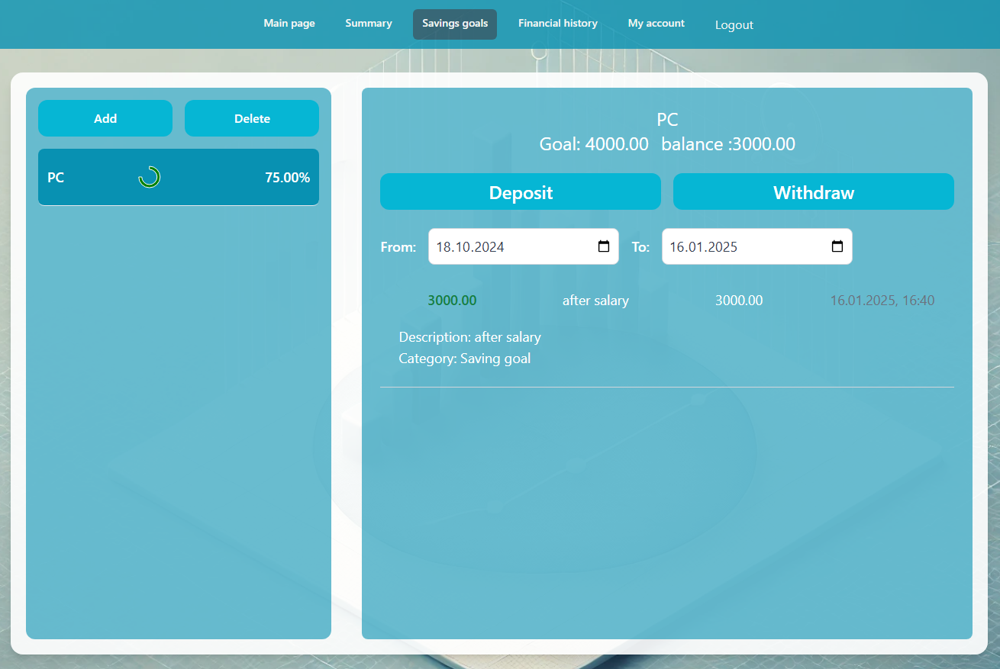
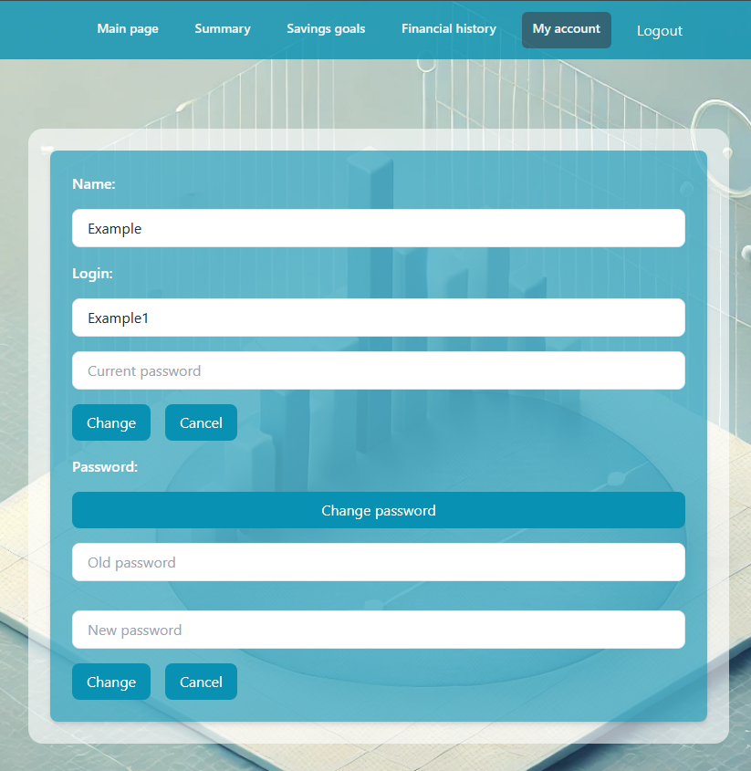
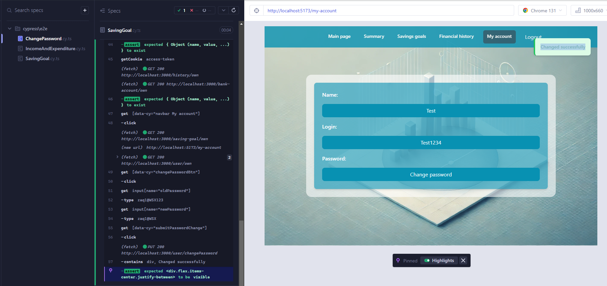

# Finance Mgmt
## Manage your finances effortlessly with our web app. Track income, expenses, and analyze your financial health—all in one place. 
## The frontend is built using React with Tailwind CSS, while the backend is powered by NestJS. JSON Web Token (JWT) is used for authorization.

## You can track your expenses and create Savings Goals to make your dream a reality. 
Chart is made with usage MUIx

## I have implemented a simple account edition page:

## I made some simple E2E tests in cypress:


# Installation

## Backend
1. Clone the repository and navigate to the backend folder:
   ```bash
   git clone https://github.com/michelangelo-source/GryGacek
   cd ./finance-mgmt-backend/
2. Insert the correct database configuration in DBconfig.ts
3. Install the required dependencies:
  ```bash
  npm install
  ```
4. Start the development server:
  ```bash
  npm start
  ```

## Frontend

1. Navigate to the frontend folder:
  ```bash
  cd ./front/GryGacek/
  ```
2. Install the required dependencies:
  ```bash
  npm install
  ```
3. Start the development server:
  ```bash
  npm start
  ```
4. Open your browser at http://localhost:5173/ and enjoy the application!

